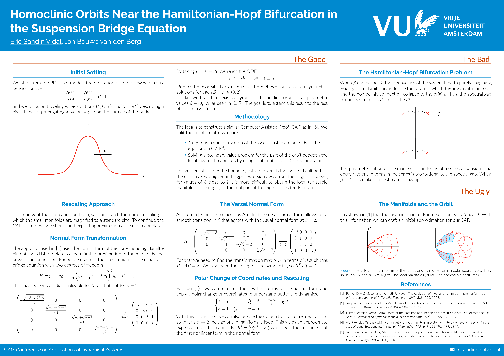

# Gemini-based Poster Template

This repository contains a modern LaTeX [beamerposter] template based on the [Gemini] theme by Anish Athalye, customized for use with the University of Cambridge / VU style and personal workflow.

<p align="center">
<a href="poster.pdf">

</a>
</p>

If you are looking for a beamer presentation theme instead, consider checking out [Auriga].

---

## About This Template

This template builds upon the original Gemini beamerposter theme and adds:

- Custom color themes (e.g., `vu`) and styling suited for Cambridge/VU branding
- Integration of logos and figure folders as per typical academic poster needs
- A Makefile and `.latexmkrc` for streamlined compilation with LuaLaTeX
- Example preamble and structure tailored for mathematical content and large-format posters

---

## Dependencies

To compile the poster successfully, you will need:

- A TeX distribution with [LuaTeX] support (e.g., TeX Live, MikTeX)
- `latexmk` if you want to use the included Makefile for easy building
- Required LaTeX packages, especially [beamerposter], which usually come pre-installed or can be fetched via [CTAN]
- The fonts [Raleway] and [Lato] installed or available to your TeX system (both are Open Font License)

---

## Usage

1. Clone or download this repository to your local machine.

2. Edit `poster.tex` to customize:
    - Paper size, column layout, and scaling
    - Title, authors, and footer content
    - Included logos (in the `logos` folder)
    - Figures (in the `figures` folder)
    - Color theme by modifying or replacing `beamercolorthemevu.sty` and updating the `\usecolortheme` command

3. Compile your poster by running:
    ```bash
    make
    ```
    This runs `latexmk` with LuaLaTeX and builds `poster.pdf`.

4. To clean auxiliary files, run:
    ```bash
    make clean
    ```

---

## Included Themes

This template currently provides:

- `vu` (custom theme based on Gemini for VU/University branding)

The original Gemini repository includes several themes:

- `gemini` (default)
- `mit`
- `labsix`

You can use those as inspiration or create your own by modifying the color theme `.sty` files.

---

## Design Goals

- **Minimal and clean:** Emphasis on clear and readable content  
- **Ready-to-use:** Includes everything needed to build posters out of the box  
- **Customizable:** Easy to tweak color themes and layouts for your institution or style

---

## Contributing & Feedback

Contributions such as bug reports, new color themes, or poster components are welcome. Given that design preferences are subjective, please open an issue or pull request early to discuss your ideas.

---

## License & Credits

This template is based on the [Gemini] theme by Anish Athalye (2018–2022), released under the MIT License. See the included `LICENSE.md` file for details.

[Gemini]: https://github.com/anishathalye/gemini  
[Auriga]: https://github.com/anishathalye/auriga  
[beamerposter]: https://github.com/deselaers/latex-beamerposter  
[LuaTeX]: http://www.luatex.org/  
[CTAN]: https://ctan.org/  
[Raleway]: https://www.fontsquirrel.com/fonts/raleway  
[Lato]: https://www.fontsquirrel.com/fonts/lato  
